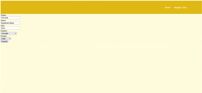

# ProyectoFinalWeb
## Creadores
### Fernando Garrote A01027503
### Alejandra Nissan A01024682

# Índice de Contenidos
1. [Instrucciones De Ejecución del Código](#Instrucciones)
2. [Descripción del Proyecto](#Descripcion)
3. [Arquitectura de Solución](Arquitectura)
4. [Acciones que se pueden realizar](#Acciones)
5. [Capturas de la página web](#Capturas)

## Instrucciones De Ejecución del Código 
1. Primero se debe clonar este repositorio en la carpeta de su agrado.
2. Para ejecutar la página web, es necesario haber descargado la librería de express, en la siguiente liga se muestran las instrucciones para su descarga: https://expressjs.com/es/starter/installing.html
3. Abrir una terminal y localizarse en la carpeta al nivel del archivo "App.js"
4. Ejecutar el comando: "npm start"
5. Abrir en un explorador web la siguiente liga http://127.0.0.1:5500/home.html

Para cualquier duda, favor de contactarnos a:
a01027503@itesm.mx
a01024682@itesm.mx

## Descripción del Proyecto 
Bookworm es una página web creada en el 2021 para ayudarte a administrar tu lectura. Puedes añadir libros y colocarles su estado de lectura: "leido", "leyendo" y "por leer". 
Núnca olvides lo que has leído y lo que te recomiendan leer después.
## Arquitectura de Solución 
El proyecto cuenta con una base de datos la cual la tenemos en MongoDB. Cada documento dentro de la colección de MongoDB representa la información de cada libro. En el código manejamos las peticiones a la base de datos desde el archivo "App.js". 

Utilizamos 
- html: "home.html", "agregarLibro.html" y "detallesLibro.html" 
- css: "index.css"
- javascript: "index.js" y "detallesLibro.js"
- express: "App.js"

## Acciones que se pueden realizar 
- El proyecto es una página web en la que se pueden agregar los libros que el usuario está leyendo, los que ya leyó y los que va a leer. 
- El usuario puede añadir, editar y borrar los libros y cambiarles el estado. 
- Cuando el usuario abre la página "home.html" aparece una pequeña descripción de la página web. En la parte de arriba a la derecha se pueden observar los botones: “Leídos”, “Leyendo”, “Por leer” y “Agregar libro”. 
- Si el usuario oprime uno de los 4 botones lo dirige a la vista correspondiente. 
- En las vistas de  “Leídos”, “Leyendo” y “Por leer” aparecen los libros correspondientes y cada libro tiene dos botones los cuales son: “Ver detalles” y “Eliminar”. 
- El botón de “Ver detalles” dirige al usuario a otra pantalla donde puede observar todos los datos del libro, esos datos los puede modificar y finalmente presionar un botón para guardar lo que se modificó. Si el usuario pone un título, autor o fecha no válidos entonces no se puede oprimir el botón de guardar. 
- El botón “Eliminar” sirve para borrar el libro de la base de datos. 
- Por último la pantalla de “Agregar libro” sirve para agregar nuevos libros y en esa pantalla se debe de agregar el título, autor, fecha, género y estado del libro, después de agregar todo lo correspondiente el usuario debe presionar enviar. Si el usuario pone un título, autor o fecha no válidos entonces no se puede oprimir el botón de enviar. 

## Capturas de la página web 

